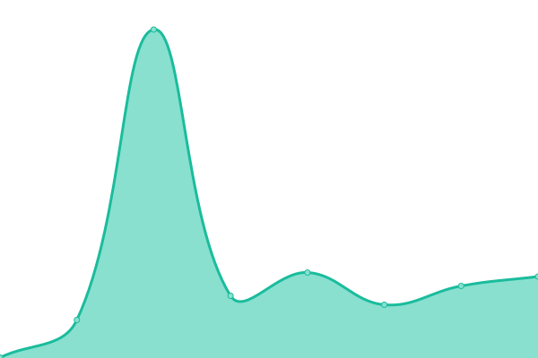
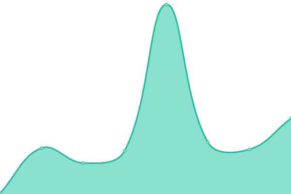

# [📈 Live Status](https://dev.thechels.uk): <!--live status--> **🟩 All systems operational**

This repository contains the open-source uptime monitor and status page for [Mat Benfield](https://thechels.uk), powered by [Upptime](https://github.com/upptime/upptime).

With [Upptime](https://upptime.js.org), you can get your own unlimited and free uptime monitor and status page, powered entirely by a GitHub repository. We use [Issues](https://github.com/MatBenfield/up/issues) as incident reports, [Actions](https://github.com/MatBenfield/up/actions) as uptime monitors, and [Pages](https://dev.thechels.uk) for the status page.

<!--start: status pages-->
<!-- This summary is generated by Upptime (https://github.com/upptime/upptime) -->
<!-- Do not edit this manually, your changes will be overwritten -->
<!-- prettier-ignore -->
| URL | Status | History | Response Time | Uptime |
| --- | ------ | ------- | ------------- | ------ |
|  [Morning](https://morning.thechels.uk) | 🟩 Up | [morning.yml](https://github.com/MatBenfield/up/commits/HEAD/history/morning.yml) | 

 217ms
     
 | 

<a href="https://dev.thechels.uk/history/morning">100.00%</a>
    

|  [toCFCws](https://app.thechels.uk) | 🟩 Up | [to-cf-cws.yml](https://github.com/MatBenfield/up/commits/HEAD/history/to-cf-cws.yml) | 

 206ms
     
 | 

<a href="https://dev.thechels.uk/history/to-cf-cws">100.00%</a>
    

|  [Blog](https://thechels.uk) | 🟩 Up | [blog.yml](https://github.com/MatBenfield/up/commits/HEAD/history/blog.yml) | 

 180ms
     
 | 

<a href="https://dev.thechels.uk/history/blog">100.00%</a>
    

|  [Finances](https://finances.thechels.uk) | 🟩 Up | [finances.yml](https://github.com/MatBenfield/up/commits/HEAD/history/finances.yml) | 

 189ms
     
 | 

<a href="https://dev.thechels.uk/history/finances">100.00%</a>
    

|  [Horoscopes](https://horofootball.thechels.uk) | 🟩 Up | [horoscopes.yml](https://github.com/MatBenfield/up/commits/HEAD/history/horoscopes.yml) | 

 157ms
     
 | 

<a href="https://dev.thechels.uk/history/horoscopes">100.00%</a>
    

|  [Crisis](https://isthereacrisis.thechels.uk) | 🟩 Up | [crisis.yml](https://github.com/MatBenfield/up/commits/HEAD/history/crisis.yml) | 

 146ms
     
 | 

<a href="https://dev.thechels.uk/history/crisis">100.00%</a>
    

<!--end: status pages-->

[**Visit our status website →**](https://dev.thechels.uk)

## 📄 License

- Code: [MIT](./LICENSE) © [Mat Benfield](https://thechels.uk)
- Data in the `./history` directory: [Open Database License](https://opendatacommons.org/licenses/odbl/1-0/)
