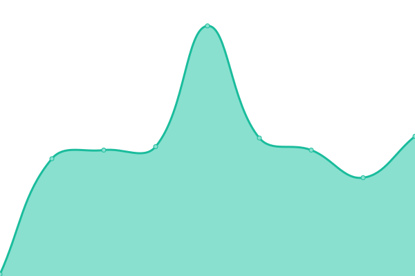
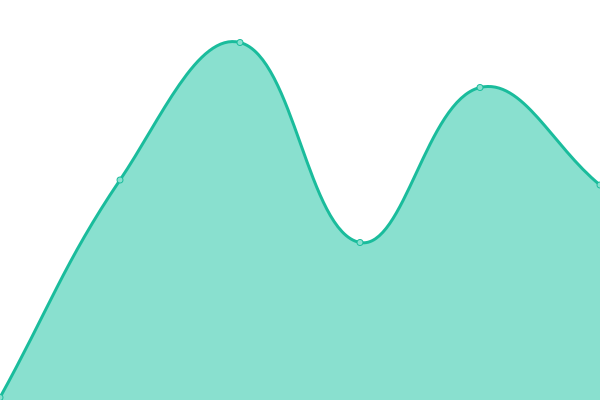

# [📈 Live Status](https://dev.thechels.uk): <!--live status--> **🟧 Partial outage**

This repository contains the open-source uptime monitor and status page for [Mat Benfield](https://thechels.uk), powered by [Upptime](https://github.com/upptime/upptime).

With [Upptime](https://upptime.js.org), you can get your own unlimited and free uptime monitor and status page, powered entirely by a GitHub repository. We use [Issues](https://github.com/MatBenfield/up/issues) as incident reports, [Actions](https://github.com/MatBenfield/up/actions) as uptime monitors, and [Pages](https://dev.thechels.uk) for the status page.

<!--start: status pages-->
<!-- This summary is generated by Upptime (https://github.com/upptime/upptime) -->
<!-- Do not edit this manually, your changes will be overwritten -->

| URL                                            | Status  | History                                                                                   | Response Time                                                                  | Uptime                                                                                                                                                                                                     |
| ---------------------------------------------- | ------- | ----------------------------------------------------------------------------------------- | ------------------------------------------------------------------------------ | ---------------------------------------------------------------------------------------------------------------------------------------------------------------------------------------------------------- |
| [Morning](https://morning.thechels.uk)         | 🟩 Up   | [morning.yml](https://github.com/MatBenfield/up/commits/master/history/morning.yml)       |  223ms   |        |
| [toCFCws](https://app.thechels.uk)             | 🟩 Up   | [to-cf-cws.yml](https://github.com/MatBenfield/up/commits/master/history/to-cf-cws.yml)   |  68ms  |    |
| [Blog](https://thechels.uk)                    | 🟩 Up   | [blog.yml](https://github.com/MatBenfield/up/commits/master/history/blog.yml)             |  86ms       |              |
| [Finance](https://finance.thechels.uk)         | 🟥 Down | [finance.yml](https://github.com/MatBenfield/up/commits/master/history/finance.yml)       |  0ms     |          |
| [Horoscopes](https://horofootball.thechels.uk) | 🟩 Up   | [horoscopes.yml](https://github.com/MatBenfield/up/commits/master/history/horoscopes.yml) |  74ms |  |
| [Crisis](https://isthereacrisis.thechels.uk)   | 🟩 Up   | [crisis.yml](https://github.com/MatBenfield/up/commits/master/history/crisis.yml)         |  107ms    |          |

<!--end: status pages-->

[**Visit our status website →**](https://dev.thechels.uk)

## 📄 License

- Code: [MIT](./LICENSE) © [Mat Benfield](https://thechels.uk)
- Data in the `./history` directory: [Open Database License](https://opendatacommons.org/licenses/odbl/1-0/)
